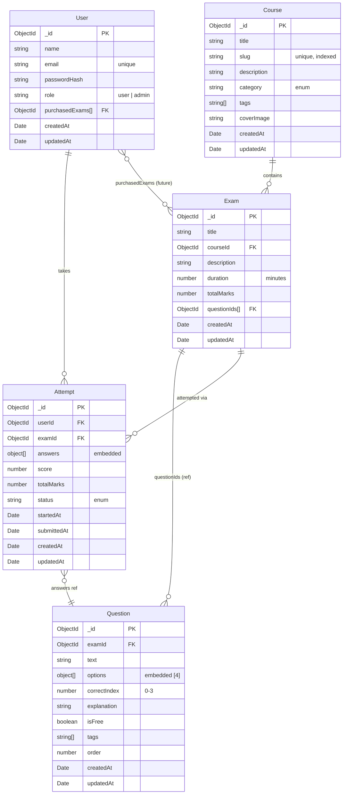
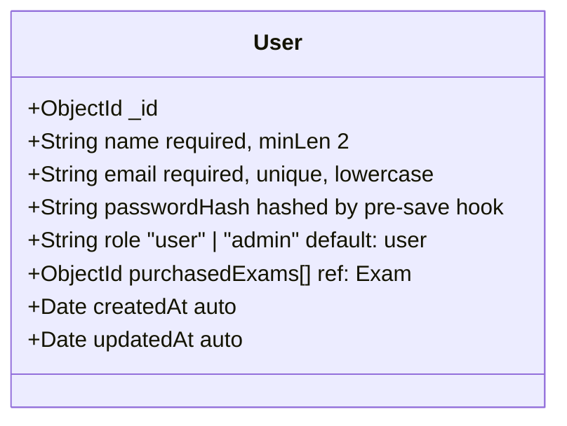
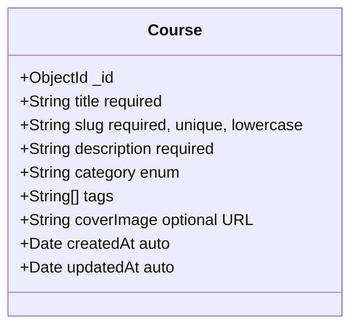
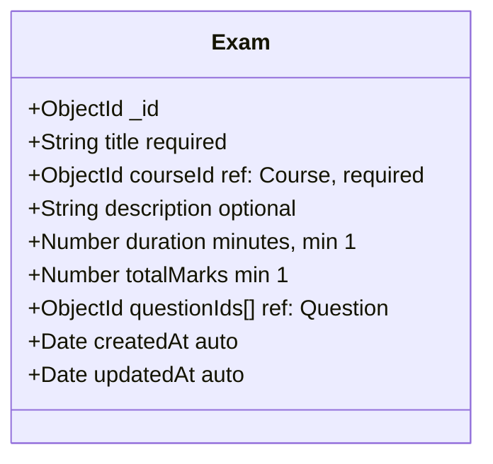
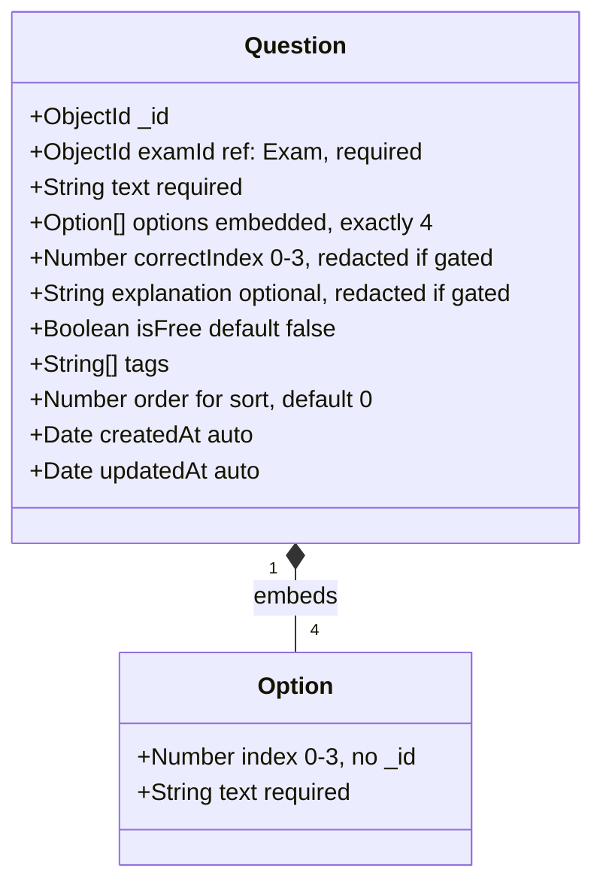
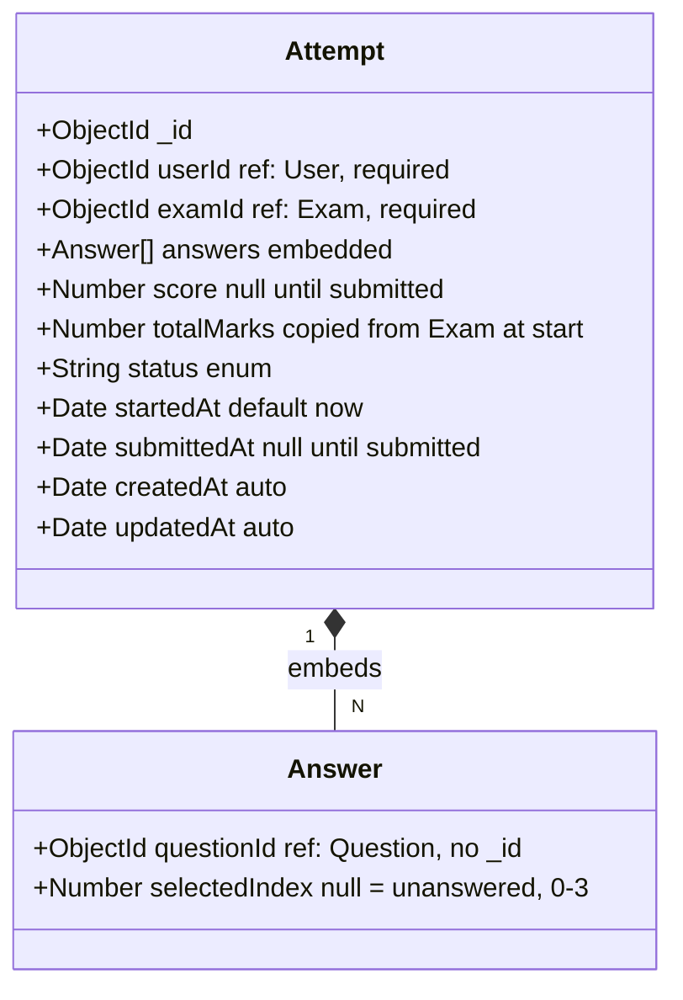
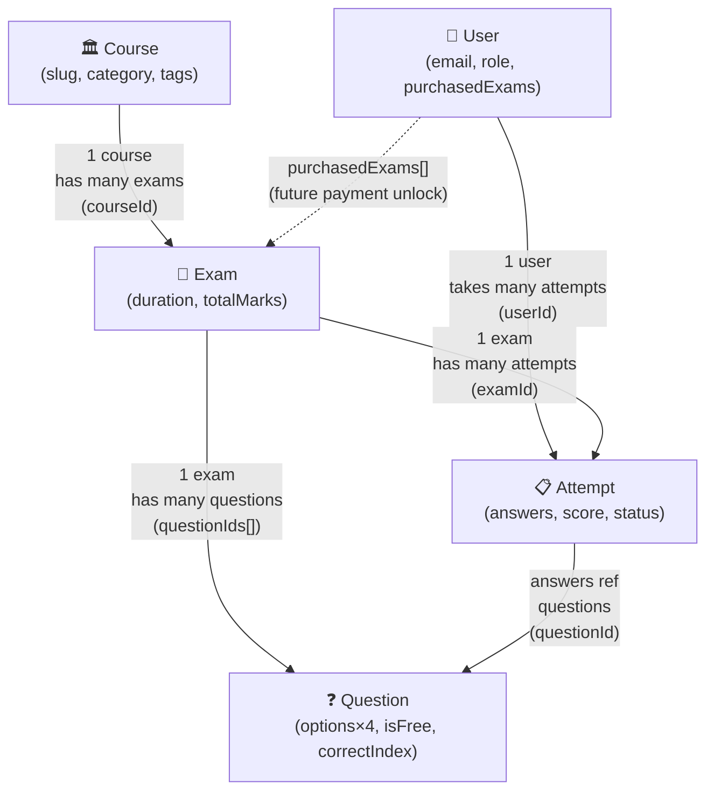

# MongoDB Models Reference

This document describes every Mongoose model used in the `apps/api` backend, the fields each collection stores, and how
the collections relate to each other.

---

## Entity Relationship Overview



---

## Models

### 1. User

**Collection:** `users`  
**File:** [`src/models/user.ts`](../apps/api/src/models/user.ts)

Stores registered accounts. Passwords are **never stored in plaintext** — a Mongoose pre-save hook hashes them with
bcrypt (12 salt rounds) automatically before writing.



| Field            | Type       | Constraints                     | Notes                       |
| ---------------- | ---------- | ------------------------------- | --------------------------- |
| `name`           | String     | required, minLength 2           | Display name                |
| `email`          | String     | required, **unique**, lowercase | Used for login              |
| `passwordHash`   | String     | required                        | Set plain → hook hashes it  |
| `role`           | String     | `"user"` \| `"admin"`           | Default `"user"`            |
| `purchasedExams` | ObjectId[] | ref: `Exam`                     | Populated on payment unlock |

**Indexes:** `email` (unique, auto from `unique: true`)

**Hooks:**

- `pre("save")` — runs `bcrypt.hash(passwordHash, 12)` if the field was modified
- `comparePassword(candidate)` — instance method that runs `bcrypt.compare`

---

### 2. Course

**Collection:** `courses`  
**File:** [`src/models/course.ts`](../apps/api/src/models/course.ts)

Top-level grouping for exams. A course maps to a real-world exam category (e.g. "UPSC Civil Services Prelims").



| Field         | Type     | Constraints                     | Notes                                  |
| ------------- | -------- | ------------------------------- | -------------------------------------- |
| `title`       | String   | required                        | Display name                           |
| `slug`        | String   | required, **unique**, lowercase | URL-safe identifier e.g `upsc-prelims` |
| `description` | String   | required                        | Shown on course card                   |
| `category`    | String   | enum (7 values)                 | Used for filtering                     |
| `tags`        | String[] | —                               | Searchable keywords                    |
| `coverImage`  | String   | optional                        | URL to cover art                       |

**Category enum values:** `government` · `engineering` · `medical` · `management` · `banking` · `language` · `other`

**Indexes:** `slug` (unique, auto) · `category` (explicit, for filter queries)

---

### 3. Exam

**Collection:** `exams`  
**File:** [`src/models/exam.ts`](../apps/api/src/models/exam.ts)

A single test within a Course (e.g. "Polity Mock Test", "JEE Kinematics Chapter Test"). Stores **references** to
Question documents (not embedded) to avoid breaching MongoDB's 16 MB BSON document limit.



| Field         | Type       | Constraints             | Notes                     |
| ------------- | ---------- | ----------------------- | ------------------------- |
| `title`       | String     | required                | Exam display name         |
| `courseId`    | ObjectId   | required, ref: `Course` | Parent course             |
| `description` | String     | optional                | Brief exam description    |
| `duration`    | Number     | required, min 1         | In **minutes**            |
| `totalMarks`  | Number     | required, min 1         | Max achievable score      |
| `questionIds` | ObjectId[] | ref: `Question`         | Ordered list of questions |

**Indexes:** `courseId` (for fetching exams by course)

> **Design decision:** Questions are stored as references, not embedded. An exam can have 100+ questions, which would
> risk exceeding the 16 MB document limit if embedded. Fetching is done with a `.populate()` or a separate
> `Question.find({ examId })` call.

---

### 4. Question

**Collection:** `questions`  
**File:** [`src/models/question.ts`](../apps/api/src/models/question.ts)

A single MCQ item. Options are **embedded** (always exactly 4). The `correctIndex` field is **redacted at the API
layer** for gated (non-free) questions that the user hasn't purchased.



| Field             | Type     | Constraints           | Notes                                                 |
| ----------------- | -------- | --------------------- | ----------------------------------------------------- |
| `examId`          | ObjectId | required, ref: `Exam` | Parent exam                                           |
| `text`            | String   | required              | The question body                                     |
| `options`         | Option[] | exactly 4             | Embedded sub-documents, no `_id`                      |
| `options[].index` | Number   | 0–3                   | Maps to A/B/C/D labels                                |
| `options[].text`  | String   | required              | Option body                                           |
| `correctIndex`    | Number   | required, 0–3         | API redacts this if `isFree: false` and not purchased |
| `explanation`     | String   | optional              | API redacts if gated                                  |
| `isFree`          | Boolean  | default `false`       | First `N` questions seeded as `true`                  |
| `tags`            | String[] | —                     | Topic tags (e.g. `["polity", "constitution"]`)        |
| `order`           | Number   | default 0             | Used for consistent sort order                        |

**Indexes:** `{ examId, order }` compound — queries for "all questions of an exam ordered by position"

#### Freemium gating logic (in `routes/exams.ts`):

```
isFree: true   → correctIndex + explanation returned as-is
isFree: false  → correctIndex = null, explanation = null (unless user purchased)
```

---

### 5. Attempt

**Collection:** `attempts`  
**File:** [`src/models/attempt.ts`](../apps/api/src/models/attempt.ts)

Records a user's session for a specific exam. The `answers` array is **embedded** (one entry per question,
`selectedIndex: null` until the user answers). Score is computed server-side on submit.



| Field                     | Type           | Constraints           | Notes                                             |
| ------------------------- | -------------- | --------------------- | ------------------------------------------------- |
| `userId`                  | ObjectId       | required, ref: `User` | Who is taking the exam                            |
| `examId`                  | ObjectId       | required, ref: `Exam` | Which exam                                        |
| `answers`                 | Answer[]       | embedded              | Pre-populated with `selectedIndex: null` on start |
| `answers[].questionId`    | ObjectId       | ref: `Question`       |                                                   |
| `answers[].selectedIndex` | Number \| null | —                     | `null` = skipped                                  |
| `score`                   | Number \| null | —                     | Calculated on submit                              |
| `totalMarks`              | Number         | required              | Snapshot from `Exam.totalMarks` at start time     |
| `status`                  | String         | enum                  | `in_progress` → `completed` or `expired`          |
| `startedAt`               | Date           | default `Date.now`    |                                                   |
| `submittedAt`             | Date \| null   | —                     | Set on submit                                     |

**Status lifecycle:**

```
in_progress  ──submit──►  completed
in_progress  ──timeout──►  expired  (future: auto-expire via timer)
```

**Indexes:**

- `{ userId, examId }` — check for an existing in-progress attempt before creating a new one
- `{ userId, status }` — fetch all completed/in-progress attempts for a user's dashboard

**Score calculation (in `routes/attempts.ts`):**

```
marksPerQuestion = totalMarks / numberOfQuestions
score = correctAnswers × marksPerQuestion
```

---

## Relationship Map



---

## Storage Strategies Summary

| Collection            | Strategy               | Reason                                                                            |
| --------------------- | ---------------------- | --------------------------------------------------------------------------------- |
| `Question.options`    | **Embedded** (4 items) | Bounded size, always fetched with question                                        |
| `Exam.questionIds`    | **Reference** array    | Unbounded — 100+ questions would exceed 16 MB limit                               |
| `Attempt.answers`     | **Embedded**           | One answer per question, fetched as a unit, size bounded by questions in the exam |
| `User.purchasedExams` | **Reference** array    | Small array of IDs, fast O(1) lookup for access control                           |
